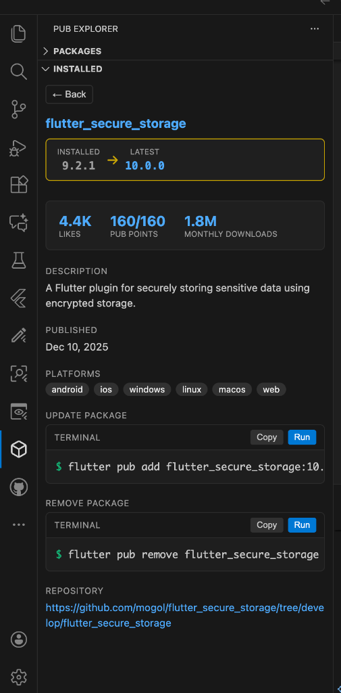
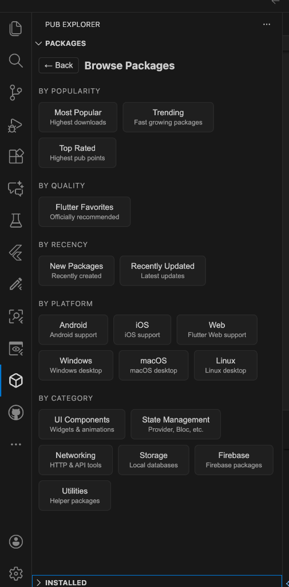
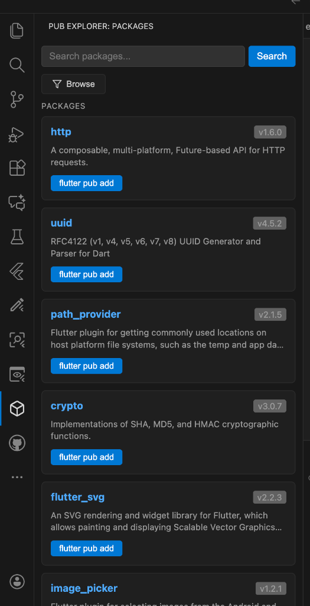
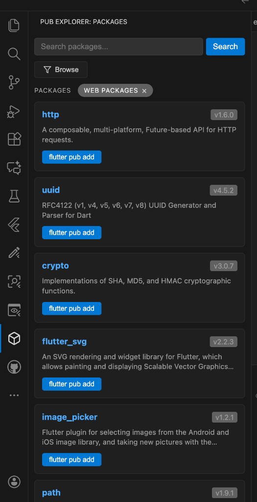
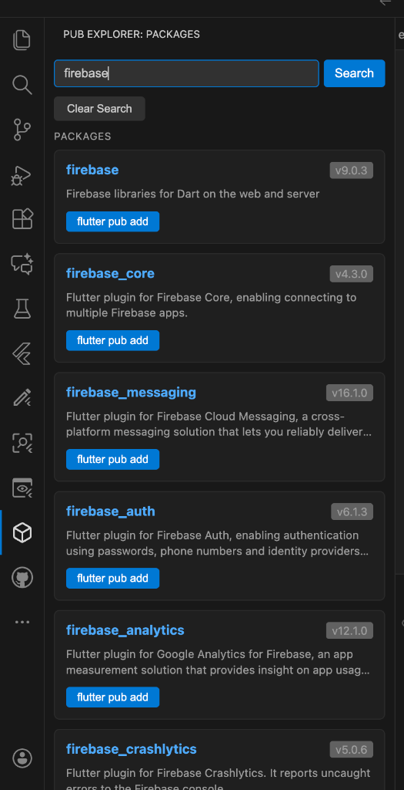

# Flutter Pub Explorer

A VSCode extension to browse, search, and add pub.dev packages to your Flutter project.

## Features

- Browse popular Flutter packages from pub.dev
- Search for specific packages
- View package details including version history
- Add packages to your Flutter project with one click (`flutter pub add`)

## Screenshots

### Package Details


### Browse Packages


### Package List


### Filtered Packages


### Search Packages


## Usage

1. Open the Pub Explorer panel from the Activity Bar (package icon)
2. Browse the default list of Flutter packages or search for specific ones
3. Click "flutter pub add" to add a package to your project
4. Click "Details" to view more information and select specific versions

## Requirements

- Flutter SDK installed and available in PATH
- A Flutter project open in VS Code

## Installation

1. Clone this repository
2. Run `npm install` to install dependencies
3. Run `npm run compile` to build the extension
4. Press F5 to run the extension in development mode

## Development

```bash
# Install dependencies
npm install

# Compile TypeScript
npm run compile

# Watch for changes
npm run watch

# Package the extension
npx vsce package
```
